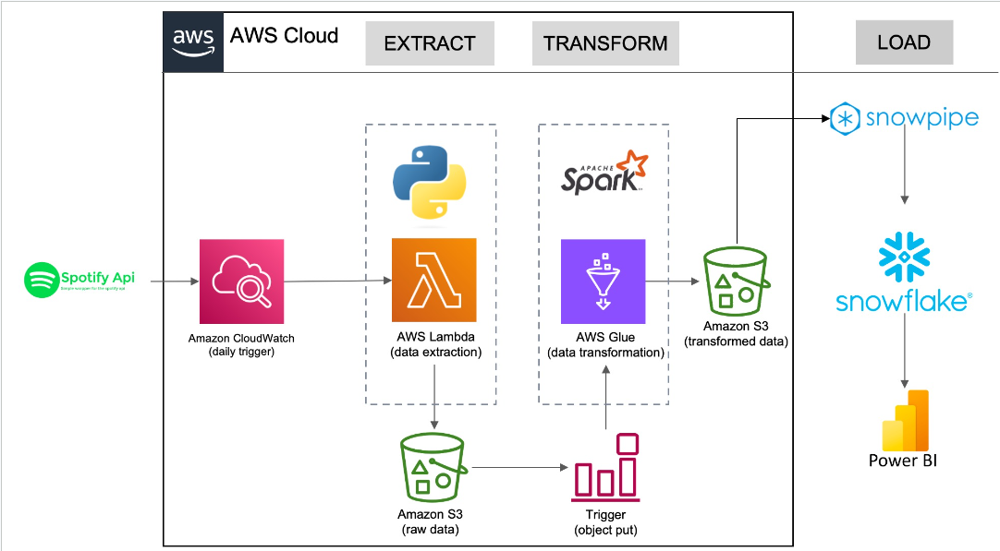

# data_engineering_spotify_glue_snowflake

In this project, I created an ETL pipeline that efficiently extracts, transforms, and loads data from the Spotify API using AWS services and Snowflake.

## Project Overview

The project involves setting up a data pipeline using a combination of AWS Lambda, AWS Glue, and Snowflake to automate the extraction, transformation, and loading (ETL) of data. 

### Components Used

- **Spotify API**: Source of the data.
- **AWS Lambda**: Extracts data from the Spotify API and stores it as raw data in Amazon S3.
- **AWS EventBridge**: Triggers the Lambda function at scheduled intervals for continuous data extraction.
- **Amazon S3**: Serves as storage for both raw and transformed data.
- **AWS Glue**: Performs data transformation tasks using Spark, moving data from the raw to the transformed state.
- **Snowflake**: Provides automated data ingestion using Snowpipe for further data analysis and as a data warehouse.
- **Power BI**: Utilized for visualization and analysis of data stored in Snowflake.

### Workflow

1. **Data Extraction**: AWS Lambda function is triggered by AWS EventBridge to extract data from the Spotify API. The extracted data is stored as JSON files in the `raw_data` folder in S3.

2. **Data Transformation**: AWS Glue job is triggered to transform the raw data stored in S3. The Glue job processes the data using Spark, transforming it into a desired format and saving it in the `transformed_data` folder in S3.

3. **Data Loading**: Snowpipe is set up to automatically ingest the transformed data from S3 into Snowflake, allowing for further analysis and serving as a comprehensive data warehouse.

### Key Differences from Previous Project

- **Current Approach**: Utilizes AWS Glue for automated data transformation and Snowflake for data warehousing.
- **Previous Approach**: Relied on Python notebooks for data processing, AWS Glue Crawler, Glue Catalog, and Athena for analysis.
- **Advantages**: The current setup with AWS Glue and Snowflake provides enhanced scalability, reduces manual intervention, and integrates more seamlessly for data analytics.

### Key Benefits

- **Automation**: Fully automated data extraction, transformation, and loading processes.
- **Scalability**: AWS Glue's managed Spark environment allows for scalable data transformations.
- **Efficiency**: Reduced manual intervention and improved performance with automated workflows.
- **Integration**: Seamless integration with Snowflake enables comprehensive analytics capabilities.
